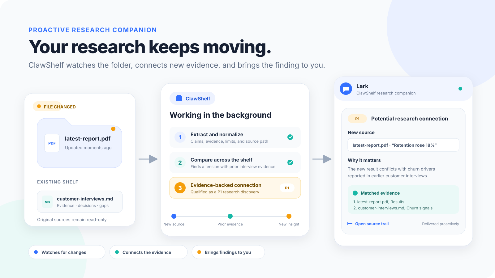
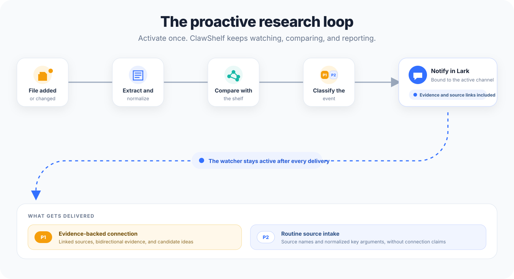
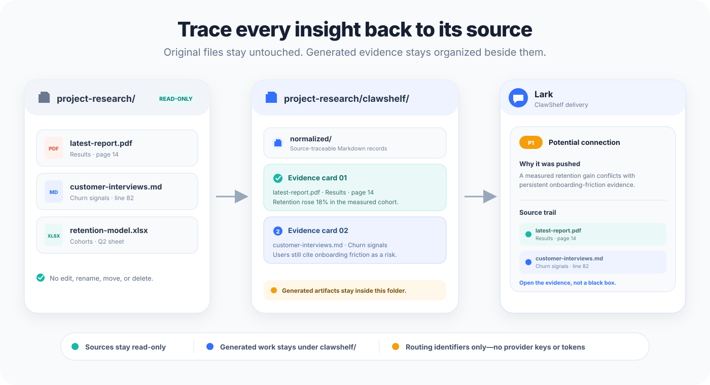

# ClawShelf

English | [简体中文](README.md)

ClawShelf turns a folder of notes, PDFs, spreadsheets, and articles into a
**proactive research companion**. Instead of waiting for you to search, it
watches the folder, processes new material, connects it with what you already
know, and brings useful, evidence-backed insights to you as the collection
grows.

You can also ask questions at any time. ClawShelf builds a source-traceable
library, answers across your files, highlights contradictions and gaps, and
suggests promising next directions.

Your original files stay untouched. ClawShelf keeps everything it creates in a
separate `clawshelf/` folder beside your sources.

<p align="center">
  
</p>

## Who ClawShelf is for

ClawShelf is useful when you have more material than you can reliably keep in
your head and want more than one-off summaries. For example:

- Researchers comparing papers, methods, evidence, and open questions.
- Product and market teams organizing reports, interviews, and meeting notes.
- Engineers tracking decisions, experiments, benchmarks, and technical risks.
- Writers building source-backed arguments and finding missing citations.
- Analysts watching a folder for new evidence, changed conclusions, or useful
  cross-source connections.

## What it does

- **Works proactively.** After you activate a shelf, ClawShelf watches for new
  and changed sources, analyzes them in the background, and notifies you when
  it finds a useful cross-source connection.
- **Builds a durable source library.** Each inspected file becomes a searchable
  Markdown record with a summary, evidence, limitations, source path, and
  confidence.
- **Answers questions across files.** Search the whole shelf in natural language
  and receive concise answers grounded in the original material.
- **Connects related evidence.** Ask ClawShelf to explain agreements,
  contradictions, gaps, and relationships between sources.
- **Suggests next directions.** Receive source-backed ideas for what to
  investigate, test, read, or write next—not just when you remember to ask.
- **Creates an interactive overview.** Generate a local, three-dimensional
  neuron map for exploring sources, signals, and their connections.

## The core feature: proactive research

Most research tools wait for a query. ClawShelf keeps working after setup.
When a source is added or changed, it automatically:

1. Extracts and organizes the new material.
2. Compares it with the evidence already on the shelf.
3. Looks for meaningful relationships, contradictions, missing evidence, and
   possible next steps.
4. Sends an update through the OpenClaw conversation where the shelf was
   activated.

Routine intake confirmations keep you informed, while stronger notifications
surface evidence-backed connections that may change a conclusion or open a new
research direction. Every connection points back to its sources, so you can
inspect the evidence instead of trusting an unexplained suggestion.

<p align="center">
  
</p>

## A neuron model for connected knowledge

Think of every source on the shelf as a neuron. ClawShelf extracts two kinds of
evidence-bearing signals from it:

- **Axon signals** describe what the source can offer to other records, such as
  an important finding, method, limitation, or transferable application.
- **Dendrite signals** describe what could activate, complement, or challenge
  the source, such as an assumption, boundary, evaluation condition, weakness,
  or unfinished direction.

When one source's axon signal fits another source's dendrite or axon signal,
ClawShelf treats the pair as a candidate “synapse.” It then checks the evidence
on both sides and the strength of the relationship instead of relying on
keyword overlap alone. Strong validated connections can trigger proactive P1
notifications. Run `/clawshelf overview` to inspect the sources, signals, and
evidence in an interactive neuron-and-synapse map.

## Quick start

### 1. Install the prerequisites

Install these tools before installing ClawShelf:

- OpenClaw with permission to read your source folder and run local commands.
- Python 3.11 or later and [`uv`](https://docs.astral.sh/uv/).
- Node.js 22 or later.
- **QMD**, the search backend ClawShelf uses to index and retrieve your
  material.
- On macOS, Homebrew SQLite, which QMD requires.

On macOS, install the required system tools and QMD with:

```bash
brew install uv sqlite
npm install -g @tobilu/qmd@2.5.3
```

On other platforms, install `uv` using its
[official instructions](https://docs.astral.sh/uv/getting-started/installation/),
then install QMD after Node.js 22 or later is available:

```bash
npm install -g @tobilu/qmd@2.5.3
```

Confirm the prerequisites before continuing:

```bash
uv --version
node --version
qmd --version
qmd status
```

Do not continue until `qmd --version` succeeds. If your shell cannot find
`qmd` after installation, add npm's global binary directory to your `PATH`,
restart the shell, and run the checks again.

### 2. Install ClawShelf from GitHub

```bash
openclaw skills install git:https://github.com/Agent-Eight/ClawShelf.git --as clawshelf
openclaw skills info clawshelf
```

This installs ClawShelf for the current OpenClaw agent. Add `--global` to the
install command if you want it available from the shared skills directory.

Start a new OpenClaw session after installation so the skill and its commands
are discovered.

If you already downloaded the repository, you can install that local folder
instead:

```bash
openclaw skills install /path/to/ClawShelf --as clawshelf
```

### 3. Choose a folder of source material

Create or select a local folder containing the material you want ClawShelf to
work with:

```text
project-research/
├── meeting-notes.md
├── market-report.pdf
└── budget.xlsx
```

Use the source folder itself, not a `clawshelf/` subfolder.

### 4. Activate the shelf

In OpenClaw, run:

```text
/clawshelf use /absolute/path/to/project-research
```

ClawShelf will:

1. Set this as the shelf for the current session.
2. Create the shelf workspace if it does not exist.
3. Infer a starting research plan from the folder and your request.
4. Report files waiting to be processed.
5. Start proactive monitoring for new and changed files.

Initial processing continues in the background. ClawShelf will show a compact
status update and may ask you to confirm or adjust the inferred research plan.
You can then leave the shelf running: as its contents change, ClawShelf will
process the changes and bring relevant discoveries back to this conversation.

### 5. Drop in files and receive proactive discoveries

Copy, drag, or download a new report, paper, note, or spreadsheet into the
activated source folder:

```text
project-research/
├── meeting-notes.md
├── market-report.pdf
└── latest-report.pdf   ← newly added or downloaded
```

You do not need to ask a question first. The background watcher automatically:

1. Extracts and summarizes the new file.
2. Compares it with the sources already on the shelf.
3. Identifies connections, contradictions, evidence gaps, and possible next
   steps.
4. Completes routine intake and proactively notifies you in the current Lark
   conversation when it finds an important connection.

Run `/clawshelf refresh` when you want to check for changes immediately. You
can still search or ask questions at any time, but ClawShelf's core value is
that it keeps working even when you do not ask.

## Everyday use

| What you want to do | Example |
| --- | --- |
| Search across sources | `/clawshelf search "evidence about liquidity risk"` |
| Explain a topic or claim | `/clawshelf explain "crowded trades"` |
| Create a synthesis brief | `/clawshelf brief "What should I investigate next?"` |
| Generate source-backed ideas | `/clawshelf ideas` |
| Refresh after changing files | `/clawshelf refresh` |
| Create the interactive map | `/clawshelf overview` |
| List indexed sources | `/clawshelf sources` |
| Check shelf health | `/clawshelf status` |
| Show the active folder | `/clawshelf pwd` |
| List known shelves | `/clawshelf folders` |

You can also describe the outcome you want in ordinary language. For example:

- “Find contradictions about customer retention.”
- “What changed after I added the latest report?”
- “Which claims have the strongest evidence?”
- “Turn these papers into a literature-review brief.”
- “Suggest the most promising next research direction.”

Most commands accept an optional folder. After `/clawshelf use`, you can
normally omit it for the rest of that session.

## When the folder changes

This is where ClawShelf's proactive behavior comes to life. Activating a shelf
starts its background watcher. When you add or change a supported source,
ClawShelf automatically processes it, compares it with the existing shelf, and
can send:

- A short confirmation that the source was archived.
- A richer update when the new material creates a useful, evidence-backed
  connection, tension, or research direction.

Both types of updates are enabled by default. Advanced users can keep routine
archive updates in the shelf without receiving them as notifications; see the
[command reference](references/commands.md) for the notification setting.

Run `/clawshelf refresh` whenever you want to check for changes immediately.
Use `/clawshelf repair` if ClawShelf reports that a shelf is incomplete or
damaged.

## Supported sources

ClawShelf has built-in extraction for:

| Source | Notes |
| --- | --- |
| Markdown | `.md` files |
| Plain text | `.txt` files |
| PDF | Text is converted into section-aware Markdown |
| Excel workbooks | `.xlsx` files, including individual sheets |
| Web pages | Only URLs you explicitly provide |

Other readable local files may work through the active agent's file-reading
tools. ClawShelf skips files it cannot read instead of guessing from their
names.

## What ClawShelf creates

All generated content stays under `<your-folder>/clawshelf/`:

```text
project-research/
├── meeting-notes.md
├── market-report.pdf
├── budget.xlsx
└── clawshelf/
    ├── normalized/
    ├── clawshelf-metadata.md
    ├── clawshelf-brief.md
    └── clawshelf-overview.html
```

| Output | Purpose |
| --- | --- |
| `normalized/` | One source-traceable Markdown record for each processed source |
| `clawshelf-metadata.md` | Source inventory, topics, coverage, claims, and confidence |
| `clawshelf-brief.md` | Optional synthesis, contradictions, gaps, ideas, and next directions |
| `clawshelf-overview.html` | Optional interactive map generated by `/clawshelf overview` |

The brief is created only when synthesis is useful or requested. The overview
is generated only when you ask for it and opens locally without a web server.
Drag to orbit, scroll to dolly, or drag a neuron to reposition it. The page
loads its drawing libraries from a version-pinned, SRI-guarded CDN, so opening
it requires an internet connection; offline it shows a notice instead of the
map.

## Language and notifications

ClawShelf supports English and Chinese. Its default `auto` mode follows the
language of your latest message.

```text
/clawshelf language en
/clawshelf language zh
/clawshelf language auto
```

You can also add `--lang en`, `--lang zh`, or `--lang auto` to override a
single command.

Background updates are delivered through the OpenClaw agent and conversation
where you activated the shelf. ClawShelf stores routing information, but never
provider passwords, API keys, or access tokens, in the shelf.

## Privacy and safety

<p align="center">
  
</p>

- Source files are read-only; ClawShelf does not edit, rename, move, or delete
  them.
- Generated files are written only inside the source folder's `clawshelf/`
  directory.
- URL extraction fetches only the exact pages you provide and does not crawl
  links.
- Local-only collections can stay local. Network access is needed only for
  user-provided URLs, services used by the active agent, or the version-pinned
  CDN libraries used when opening the optional overview.
- Answers and suggestions identify their supporting sources and distinguish
  evidence from speculation.

ClawShelf can support research and decision-making, but it is not a substitute
for professional legal, medical, or financial advice and should not make
autonomous high-stakes decisions.

## Known limitations

- Image-only or heavily scanned PDFs may need external OCR, especially for
  unsupported scripts or poor-quality scans.
- Password-protected, corrupted, or unsupported files may be skipped.
- Spreadsheet extraction reads workbook content but does not reproduce complex
  interactive Excel behavior.
- Web-page extraction does not sign in, bypass paywalls, or follow links.
- Generated summaries and ideas should be checked against the cited sources
  before important use.
- Other agent harnesses may use ClawShelf, but installation, command discovery,
  and local-file permissions vary by harness.

## Troubleshooting

### ClawShelf is not available after installation

Start a new OpenClaw session, then verify the installation:

```bash
openclaw skills info clawshelf
openclaw skills check
```

### A required tool is missing

Confirm that `uv`, Node.js 22 or later, and QMD are installed:

```bash
uv --version
node --version
qmd --version
qmd status
```

If QMD is missing, install the compatible version:

```bash
# macOS only: install QMD's SQLite dependency first
brew install sqlite

# all platforms
npm install -g @tobilu/qmd@2.5.3
```

If `qmd` is still not found, add npm's global binary directory to your `PATH`
and restart your shell.

### ClawShelf is using the wrong folder

Select the exact source folder again:

```text
/clawshelf use /absolute/path/to/the/source-folder
```

Use `/clawshelf pwd` to confirm the active shelf or `/clawshelf folders` to see
known shelves.

### Files are missing from search

Run `/clawshelf status`, then `/clawshelf refresh`. Check that the files use a
supported format and that OpenClaw has permission to read them. If the status
reports a partial shelf, run `/clawshelf repair`.

### The interactive overview does not open from chat

Some chat channels block local `file://` links. Open the reported
`clawshelf-overview.html` path directly on the computer that owns the shelf, or
ask the agent to attach the HTML file.

## Documentation

- [Full command reference](references/commands.md)
- [Architecture and skill design](docs/skill-design.md)
- [Compatibility with other agent harnesses](references/harness-compatibility.md)
- [Idea-generation method](docs/idea-generation-method.md)
- [Release history](CHANGELOG.md)
- [Security and responsible disclosure](SECURITY.md)

## License

Copyright 2026 ClawShelf.

Licensed under the [MIT License](LICENSE). Third-party notices are listed in
[NOTICE](NOTICE).
