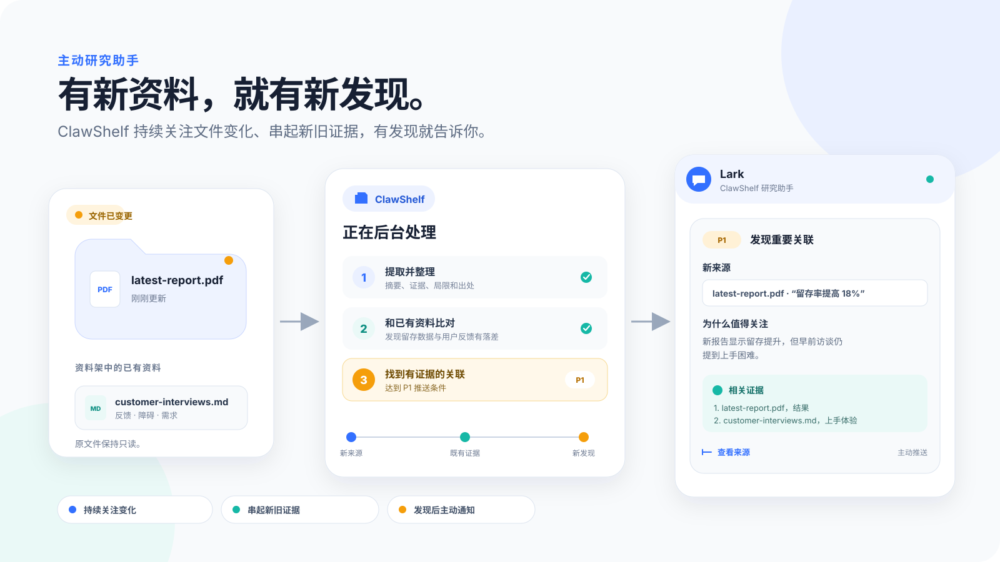
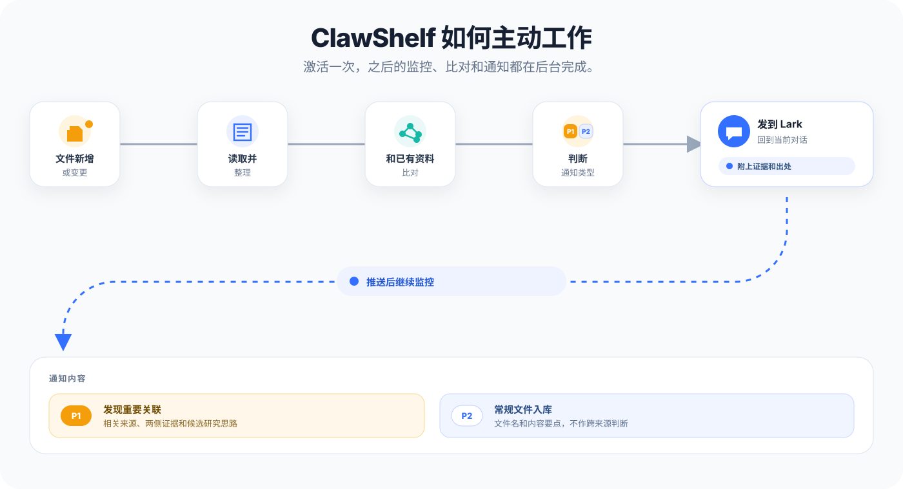
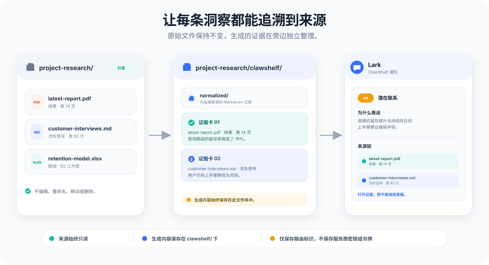

# ClawShelf

[English](README.en.md) | 简体中文

ClawShelf 是一个基于本地文件夹的**研究助手**。把装有笔记、PDF、表格和文章的文件夹
设为“资料架”后，它会持续留意其中的变化：新资料一进来，就自动整理并与已有资料
对照；发现值得关注的相互印证、冲突或证据缺口时，会及时提醒你。

你也可以随时直接提问。ClawShelf 能跨文件检索，帮你看清不同资料如何相互印证、
哪里彼此冲突、还缺哪些证据，以及接下来值得查什么。

ClawShelf 不会改动原始文件；所有生成内容都放在源文件夹下单独的 `clawshelf/`
目录中。

<p align="center">
  
</p>

## ClawShelf 适合谁

如果资料越积越多，单靠记忆或一次性摘要已经不够，ClawShelf 就能派上用场。例如：

- 研究人员：比较论文、方法、证据和未解决的问题。
- 产品和市场团队：整理报告、访谈和会议记录。
- 工程师：跟踪决策、实验、性能基准和技术风险。
- 写作者：梳理论据、核对来源并补齐引用。
- 分析师：关注新增证据、结论变化和跨来源关联。

## 它能做什么

- **持续处理新资料。** 激活资料架后，ClawShelf 会留意新增和变更的文件，
  在后台完成整理和分析。
- **建立可长期维护的资料库。** 每份处理过的资料都会生成一份可搜索的 Markdown 记录，
  保留摘要、证据、适用范围、源路径和置信度。
- **跨文件检索和问答。** 直接用自然语言提问，回答会以原始资料为依据，并附上出处。
- **串起不同来源。** 找出不同资料相互印证、彼此冲突或证据不足的地方。
- **提示下一步。** 告诉你接下来值得查什么、验证什么，或从哪里继续读、继续写。
- **生成交互式地图。** 用一张可在本地直接打开的三维神经元地图查看资料、
  信号及其关联。

## 核心能力：主动分析新资料

多数研究工具要等你提问才开始工作。资料架一经激活，ClawShelf 就会持续关注源文件夹。
有文件新增或修改时，它会自动：

1. 提取内容，并整理成标准化记录。
2. 和资料架里的已有证据交叉比对。
3. 找出新的关联、冲突、证据缺口和值得继续追查的线索。
4. 把结果发回激活资料架时所在的 OpenClaw 对话。

ClawShelf 用 P1 和 P2 区分这类事件：P1 表示经过多份资料交叉核验后确认的重要关联；
P2 表示资料已经正常入库，但没有形成 P1 关联。P2 只发一条简短确认；P1 会详细说明
发现内容并附上出处，方便回到原文核对。

<p align="center">
  
</p>

## 神经元模型：资料如何建立关联

可以把整个资料架看成一张神经网络：每份资料都是一个神经元。ClawShelf 会从中提取
两类信号，每条信号都能回到原文核对。

- **轴突信号负责输出**：记录这份资料能提供哪些发现、方法、局限或可复用的做法。
- **树突信号负责接收**：记录这份资料依赖哪些前提、缺少哪些证据、可能被哪些情况推翻，
  以及还有哪些问题尚待解决。

一份资料的轴突信号如果能接上另一份资料的树突或轴突信号，就会形成一条候选“突触”。
ClawShelf 不会因为出现了相同关键词就直接连线，而是继续核对两侧证据，判断这条关系
是否站得住。如果一条联系既可靠又重要，就会触发 P1 通知。运行
`/clawshelf overview`，可以查看这张关系网，以及每条联系背后的证据。

## 快速开始

### 1. 安装依赖

安装 ClawShelf 前，请先准备好：

- OpenClaw；需要具备读取源文件夹和运行本地命令的权限。
- Python 3.11 或更高版本，以及 [`uv`](https://docs.astral.sh/uv/)。
- Node.js 22 或更高版本。
- **QMD**，ClawShelf 用它索引和检索资料。
- macOS 还需通过 Homebrew 安装 SQLite，供 QMD 使用。

在 macOS 上，使用以下命令安装所需系统工具和 QMD：

```bash
brew install uv sqlite
npm install -g @tobilu/qmd@2.5.3
```

在其他平台上，请按照
[`uv` 官方说明](https://docs.astral.sh/uv/getting-started/installation/)安装 `uv`。
确认已安装 Node.js 22 或更高版本后，再安装 QMD：

```bash
npm install -g @tobilu/qmd@2.5.3
```

安装完成后，运行以下命令确认各项依赖可用：

```bash
uv --version
node --version
qmd --version
qmd status
```

确认 `qmd --version` 能正常返回版本号。如果安装后终端仍找不到 `qmd`，
把 npm 的全局二进制目录加入 `PATH`，重新打开终端后再检查一次。

### 2. 从 GitHub 安装 ClawShelf

```bash
openclaw skills install git:https://github.com/Agent-Eight/ClawShelf.git --as clawshelf
openclaw skills info clawshelf
```

上述命令会把 ClawShelf 安装到当前 OpenClaw Agent 中。加上 `--global` 可安装到共享
技能目录。

安装完成后，启动一个新的 OpenClaw 会话，让它重新加载技能和命令。

如果仓库已经下载到本地，也可以直接从本地文件夹安装：

```bash
openclaw skills install /path/to/ClawShelf --as clawshelf
```

### 3. 选择资料所在的文件夹

把要研究的资料放进同一个本地文件夹，或者直接选择一个已有文件夹：

```text
project-research/
├── meeting-notes.md
├── market-report.pdf
└── budget.xlsx
```

这里要选源文件夹本身，不要选择里面的 `clawshelf/` 子文件夹。

### 4. 激活资料架

在 OpenClaw 中运行：

```text
/clawshelf use /absolute/path/to/project-research
```

ClawShelf 会：

1. 把该文件夹设为当前会话的资料架。
2. 创建 `clawshelf/` 工作区（如果还没有）。
3. 根据文件夹内容和你的需求，拟一份初步研究计划。
4. 列出等待处理的文件。
5. 启动文件监控。

首批文件会在后台处理。ClawShelf 会给出一条简短的状态说明，必要时还会请你确认或
调整研究计划。之后不用守着它：文件夹有变化时，ClawShelf 会自行处理，并把值得关注的
结果发回当前对话。

### 5. 放入新资料，ClawShelf 自动分析

把新的报告、论文、笔记或表格复制、拖入或直接下载到已经激活的源文件夹：

```text
project-research/
├── meeting-notes.md
├── market-report.pdf
└── latest-report.pdf   ← 新放入或下载的文件
```

接下来无需再输入命令。ClawShelf 会在后台生成摘要、与已有资料对照，并找出关联、
冲突和证据缺口。处理完成后，它会发来一条入库确认；如果发现 P1 关联，还会把消息
发回激活资料架时所在的对话，说明发现了什么并附上出处。本文的配图以 Lark 对话为例。

想马上检查变化，可以运行 `/clawshelf refresh`。当然也可以随时搜索或提问；
区别在于，即使你什么都不问，ClawShelf 也会继续处理新资料。

## 日常使用

| 你想做什么 | 示例 |
| --- | --- |
| 跨来源搜索 | `/clawshelf search "关于流动性风险的证据"` |
| 解释主题或观点 | `/clawshelf explain "拥挤交易"` |
| 生成综合简报 | `/clawshelf brief "下一步应该调查什么？"` |
| 根据现有证据寻找新线索 | `/clawshelf ideas` |
| 立即扫描文件变化 | `/clawshelf refresh` |
| 创建交互式地图 | `/clawshelf overview` |
| 查看已索引来源 | `/clawshelf sources` |
| 检查资料架状态 | `/clawshelf status` |
| 查看当前文件夹 | `/clawshelf pwd` |
| 查看已有资料架 | `/clawshelf folders` |

你也可以直接描述想要的结果。例如：

- “找出几份资料对客户留存的说法有哪些矛盾。”
- “加入最新报告后，原有结论有哪些变化？”
- “哪些观点的证据最充分？”
- “把这些论文整理成一份文献综述。”
- “接下来最值得研究什么？”

大多数命令都可以带文件夹参数。运行 `/clawshelf use` 后，
当前会话里的后续命令通常不必再写文件夹。

## 通知设置

P1 和 P2 通知默认都会发送。若只想接收 P1，可以关闭 P2；文件仍会正常处理，
记录也照常保存在资料架中。设置方法见[完整命令参考](references/commands.md)。

想立即扫描文件变化，运行 `/clawshelf refresh`。如果资料架状态显示不完整或损坏，
运行 `/clawshelf repair`。

## 支持的来源

ClawShelf 可以直接处理以下格式：

| 来源 | 说明 |
| --- | --- |
| Markdown | `.md` 文件 |
| 纯文本 | `.txt` 文件 |
| PDF | 提取文本并按章节整理成 Markdown |
| Excel 工作簿 | `.xlsx` 文件，可读取各个工作表 |
| 网页 | 仅处理你明确提供的 URL |

能否处理其他本地格式，取决于当前 Agent 是否有相应的读取工具。遇到无法读取的文件时，
ClawShelf 会跳过，不会只看文件名猜内容。

## ClawShelf 会生成哪些文件

所有整理结果都保存在 `<your-folder>/clawshelf/` 下：

```text
project-research/
├── meeting-notes.md
├── market-report.pdf
├── budget.xlsx
└── clawshelf/
    ├── normalized/
    ├── clawshelf-metadata.md
    ├── clawshelf-brief.md
    └── clawshelf-overview.html
```

| 输出 | 用途 |
| --- | --- |
| `normalized/` | 每份已处理资料对应一份 Markdown 记录，保留来源路径和证据 |
| `clawshelf-metadata.md` | 资料清单、主题、覆盖范围、主要观点和置信度 |
| `clawshelf-brief.md` | 按需生成的综合简报，汇总共识、分歧、证据缺口和下一步建议 |
| `clawshelf-overview.html` | 运行 `/clawshelf overview` 后生成的交互式地图 |

仅在需要综合分析多份资料，或你明确要求时，才会生成简报。交互式地图也只在运行命令后
创建，可以直接在本地打开，不需要 Web 服务器。拖动背景可旋转视角，滚轮可拉近或拉远，
拖动神经元可调整位置。页面会从带版本锁定和 SRI 校验的 CDN 加载绘图库，因此打开地图时
需要联网；离线时页面会显示提示，而不会显示地图。

## 语言与通知

ClawShelf 支持中文和英文。默认使用 `auto`，会按你最近一条消息的语言回复。

```text
/clawshelf language en
/clawshelf language zh
/clawshelf language auto
```

也可以给单条命令加上 `--lang en`、`--lang zh` 或 `--lang auto` 来指定语言。

后台消息会回到激活资料架时所在的 OpenClaw 对话，并由同一个 Agent 处理。
资料架只保存消息投递所需的路由标识，不保存服务商密码、API 密钥或访问令牌。

## 隐私与安全

<p align="center">
  
</p>

- ClawShelf 只会读取源文件，不会编辑、重命名、移动或删除它们。
- 生成文件只会写入源文件夹下的 `clawshelf/` 目录。
- 处理 URL 时，只读取你明确提供的页面，不会继续抓取页面里的链接。
- 所有资料和生成文件都可以保存在本机。只有读取你提供的 URL、当前 Agent 调用外部服务，
  或打开交互式地图并加载带版本锁定的 CDN 绘图库时，才需要联网。
- 回答和建议都会标明出处，并区分原文证据和推测。

ClawShelf 可以辅助研究和决策，但不能替代专业的法律、医疗或财务意见，
也不应替你做出高风险决定。

## 已知限制

- 只含图像或以扫描页为主的 PDF 可能需要额外的 OCR 工具。如果 OCR 不支持文档所用的
  语言或文字，或扫描质量较差，识别结果可能不完整。
- 受密码保护、损坏或格式不受支持的文件可能会被跳过。
- ClawShelf 可以读取工作簿内容，但不会还原复杂的 Excel 交互功能。
- 读取网页时，ClawShelf 不会登录、绕过付费墙或继续访问页面里的链接。
- 把摘要或建议用于重要决策前，请根据所附出处核对原文。
- ClawShelf 也可以在其他 Agent 运行环境中使用，但安装方式、命令加载和本地文件权限
  可能不同。

## 故障排除

### 安装后找不到 ClawShelf

启动一个新的 OpenClaw 会话，然后检查安装状态：

```bash
openclaw skills info clawshelf
openclaw skills check
```

### 缺少必需工具

确认 `uv`、Node.js 22 或更高版本，以及 QMD 都已安装：

```bash
uv --version
node --version
qmd --version
qmd status
```

如果没有安装 QMD，请安装与本项目兼容的版本：

```bash
# 仅 macOS：先安装 QMD 的 SQLite 依赖
brew install sqlite

# 所有平台
npm install -g @tobilu/qmd@2.5.3
```

如果仍找不到 `qmd`，把 npm 的全局二进制目录加入 `PATH`，然后重新打开终端。

### ClawShelf 使用了错误的文件夹

重新选择正确的源文件夹：

```text
/clawshelf use /absolute/path/to/the/source-folder
```

用 `/clawshelf pwd` 确认当前资料架，或用 `/clawshelf folders` 查看已有资料架。

### 搜索结果缺少文件

依次运行 `/clawshelf status` 和 `/clawshelf refresh`。确认文件格式受支持，
并检查 OpenClaw 是否有读取权限。如果资料架状态不完整，运行 `/clawshelf repair`。

### 无法从聊天中打开交互式地图

部分聊天工具无法打开本地 `file://` 链接。请在资料架所在的电脑上直接打开
`clawshelf-overview.html`，或让 Agent 把该 HTML 文件作为附件发出来。

## 文档

- [完整命令参考](references/commands.md)
- [架构与技能设计](docs/skill-design.md)
- [与其他 Agent 运行环境的兼容性](references/harness-compatibility.md)
- [研究思路生成方法](docs/idea-generation-method.md)
- [发布历史](CHANGELOG.md)
- [安全政策与漏洞披露](SECURITY.md)

## 许可证

Copyright 2026 ClawShelf.

本项目采用 [MIT License](LICENSE)。第三方声明见 [NOTICE](NOTICE)。
