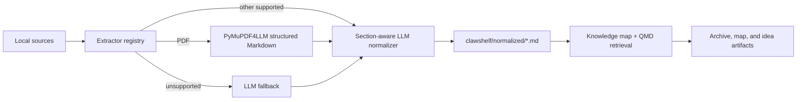

# ClawShelf

ClawShelf turns a growing folder of notes, PDFs, spreadsheets, and articles into
a proactive research and file-management companion. It summarizes and archives
source material, keeps a modular knowledge map searchable through your active
harness, and proposes source-backed ideas as new files arrive.

Use it when you want more than a one-off summary: you want a durable shelf that
remembers what the files say, shows where evidence came from, and acts like a
research secretary that can point out links, gaps, contradictions, and promising
next directions.

## Three functions

1. **Content summarization and archiving** — every inspected source becomes a
   stable Markdown record with summary, claims, evidence, source path, hash, and
   confidence.
2. **Modular search and knowledge map** — the shelf is organized by topics,
   claims, methods, tensions, gaps, and source clusters. Users ask natural
   language questions through Lark, Feishu, WeChat, Claude, Codex, OpenClaw, or
   another harness; QMD stays behind the scenes.
3. **Proactive idea generation** — when the collection changes, ClawShelf looks
   for new insight, changed conclusions, cross-source relationships, and the
   best next research direction. This is the core companion behavior.

## Architecture



The input folder is read-only. ClawShelf writes only below `<input>/clawshelf/`:

```text
<input>/
└── clawshelf/
    ├── normalized/                # one source-traceable Markdown record/source
    ├── clawshelf-metadata.md       # archive and source inventory
    ├── clawshelf-brief.md          # knowledge map, synthesis, idea cards
    └── clawshelf-overview.html     # interactive neuron/synapse map of the shelf
```

## Quick start

### 1. Install the skill

From your OpenClaw environment, install ClawShelf from its local directory:

```bash
openclaw skills install /path/to/ClawShelf
openclaw skills info clawshelf
```

Start a new OpenClaw session after installation. ClawShelf will prompt for, or
install, its required tools (`uv` and QMD) when needed. On macOS, you may also
need `brew install sqlite` if prompted.

### 2. Put files in a local folder

Create or choose a local folder containing the documents you want to research.
For example:

```text
project-research/
├── meeting-notes.md
├── market-report.pdf
└── budget.xlsx
```

Your source files remain read-only. ClawShelf creates its own workspace inside
that folder at `project-research/clawshelf/`.

### 3. Use the folder

In a new OpenClaw session, invoke the skill with a slash command or ask
naturally. ClawShelf supports English and Chinese responses; by default it uses
the language of your latest message.

Set the working folder for the current chat/session:

```text
/clawshelf use /path/to/project-research
```

This is the normal first command. It checks whether that exact folder is ready,
creates any missing shelf structure, and starts the watcher. The command reports
pending sources without blocking on model work; the watcher reconciles them in
the background. Quick onboarding infers a Shelf
Plan from folder names, files, and the current request, pre-fills all five
onboarding fields, and asks you to confirm or edit the result. Unanswered
fields stay `unknown`, so setup does not block on a blank form.

Then search or update the shelf:

```text
/clawshelf search "evidence about liquidity risk"
/clawshelf graph "retail trading flow"
/clawshelf overview
/clawshelf explain "crowded trades"
/clawshelf refresh
```

Advanced users may still run `/clawshelf status`, `/clawshelf onboard`, or
`/clawshelf repair` directly. They are not required for the normal first run.

For developer/debug runs, the watcher can still be started manually:

```text
/clawshelf watch /path/to/project-research
```

When ClawShelf is installed in an OpenClaw agent, the watch capability is
enabled automatically; the folder still has to be explicit through
`/clawshelf use`. The watcher records P1/P2 events under
`project-research/clawshelf/events/`. P1 means the source has a scored,
source-backed creative relationship to existing shelf records. P2 means the
source completed intake without clearing every P1 quality gate and also
notifies by default. Set
`notification_policy` to `p1_only` to retain P2 records without delivering
them. Notification destinations are decided by the host environment rather than
hard-coded by ClawShelf. `/clawshelf use` binds the originating OpenClaw agent,
channel, canonical session, owner-DM target, and account as one route; all
watcher scoring and notification turns reuse that same agent.

Each shelf stores its behavior in `<shelf>/clawshelf/clawshelf-config.json`. Set
`notification_policy` defaults to `p1_p2`; set it to `p1_only` for P1-only
delivery. `creativity_scoring` controls candidate limits, host scoring, and
`novelty_preference` from 0 (strong overlap) to 1 (evidence-backed novelty).
Its `semantic_retrieval` setting (`auto`, `off`, or `required`) enables a small
QMD vector fallback only when deterministic recall has fewer than
`semantic_candidate_target` candidates (default 3). Vector similarity is audit
metadata, not a creativity score or a P1 signal; the normal score, confidence,
verdict, and bidirectional-evidence gates still decide P1/P2.
The same file exposes `delivery_binding` with the bound `agent`, canonical
`session`, `channel`, owner-DM `target`, and `account`. These are routing
identifiers, not credentials; app secrets and tokens are never stored. After
editing all five consistently, run `/clawshelf reset <folder>` to apply the
new route.
The advanced `threshold` and `min_confidence` settings are the final P1 quality
gates. A P1 also requires a `p1_candidate` verdict and evidence from both
records; an unscored intake records `creativity_score: null`, never a fake zero.

Useful switches and helpers:

- `/clawshelf language <auto|en|zh>` — choose response language.
- `/clawshelf pwd` — show the current working folder.
- `/clawshelf folders` — list known or recently used shelves.
- Add `--lang en`, `--lang zh`, or `--lang auto` to override one command.

Or ask naturally:

```text
Analyze /path/to/project-research. I am researching retail trading flow and
crowded trades. Build the shelf, map the themes, and suggest the strongest next
research direction.
```

For the full command contract, see
[references/commands.md](references/commands.md).

### What to expect

ClawShelf will inspect the documents, extract and normalize their content, and
create the following outputs under `<your-folder>/clawshelf/`:

- `normalized/` — one source-traceable Markdown record for each processed file.
  Records include an executive summary, paper role in the shelf, research
  question, method/data/setting, evidence-backed claims, limitations, RAG terms,
  axon/dendrite idea signals, and connection hooks.
  Limitations are split into universal `Use Conditions` and
  `Improvement Directions`, so every research article states both how it can be
  used safely and how the work could be strengthened.
- `clawshelf-metadata.md` — archive and source inventory: sources, topics,
  coverage, claims, methods, usefulness, and confidence.
- `clawshelf-brief.md` — knowledge map, evidence-backed synthesis, tensions,
  gaps, reusable concepts, idea cards, and next research directions. It is
  created when synthesis or proactive analysis is useful, not on every setup.
- `clawshelf-overview.html` — an on-demand interactive neuron/synapse map:
  every normalized source is a neuron drawn with its dendrite and axon
  signals, synapses join evidence-backed signal pairs (plus a stronger
  confirmed class for validated P1 idea sparks), and semantic similarity keeps
  related sources close. It embeds its rendering library, so it is fully
  self-contained and is regenerated only by `/clawshelf overview`.

It also reports which files were processed or skipped, key findings, and any
limitations. Markdown, text, PDFs, `.xlsx` workbooks, and individual URLs have
built-in extraction; PDFs are converted to section-aware Markdown before
normalization. Other readable local files may use a fallback path. Image-only
PDFs attempt OCR, but unsupported scripts or unavailable OCR data may still
need additional handling.

After setup, search naturally:

- "Search this shelf for evidence about liquidity risk."
- "Find contradictions about retail flow."
- "What changed after I added these new papers?"
- "What is the best next research direction?"

For implementation details, see [docs/skill-design.md](docs/skill-design.md).
For the planned idea-generation layer, see
[docs/idea-generation-method.md](docs/idea-generation-method.md).

## License

Copyright 2026 ClawShelf. Licensed under the MIT License.
See [LICENSE](LICENSE) and [NOTICE](NOTICE).

See [CHANGELOG.md](CHANGELOG.md) for release history and
[SECURITY.md](SECURITY.md) for responsible-disclosure guidance.

## Other harnesses

Codex, Claude Code, OpenCode, and similar harnesses can use the same skill
instructions and scripts when they meet the capability requirements in
[references/harness-compatibility.md](references/harness-compatibility.md).
Their skill installation/discovery mechanism is harness-specific.
