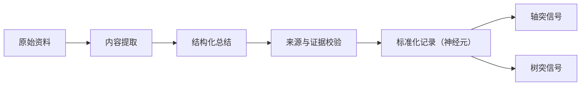
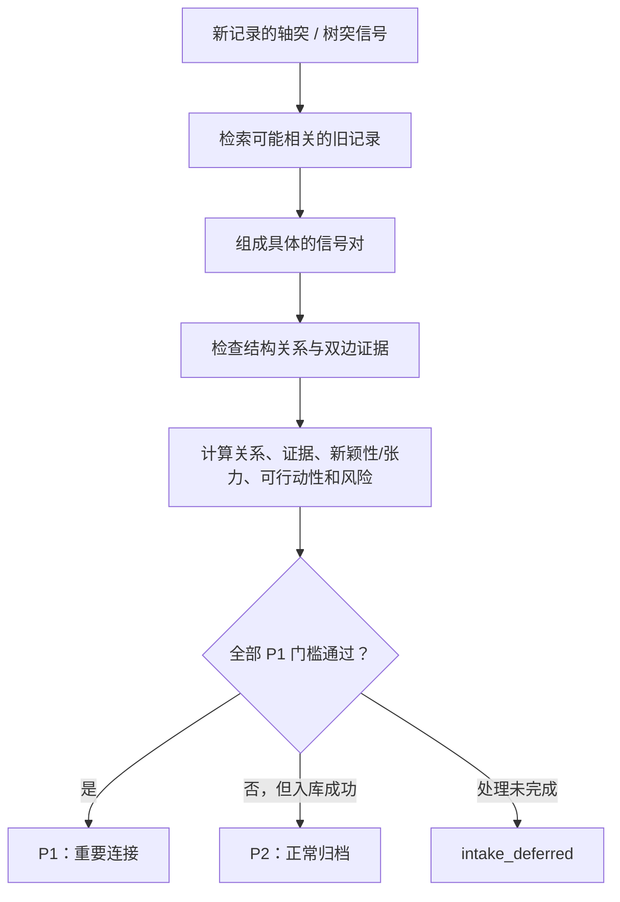

# 神经元模型：资料之间如何建立连接

## 为什么使用这个类比

如果只把资料看成一堆文本块，系统很容易把“词语相近”误认为“观点相关”。ClawShelf 用神经元类比，强迫关系建模回答一个更具体的问题：

> 一份资料能够向外提供什么信号，又有哪些条件、缺口或边界可以被其他资料补足、挑战或激活？

这个类比的价值在于区分信号方向和关系类型。实现仍使用明确的数据字段、证据和评分规则，而不是模拟真实生物神经网络。

## 概念映射

| 神经元类比 | ClawShelf 中的含义 | 例子 |
| --- | --- | --- |
| 神经元 | 一份完成标准化的来源记录 | 一篇论文、一份市场报告、一篇会议记录 |
| 轴突信号 | 该资料主动向外提供的高显著性内容 | 核心贡献、强方法、关键局限、可复用应用方式 |
| 树突信号 | 等待其他证据响应的条件、边界或开放接口 | 假设、数据边界、指标选择、失败模式、延伸方向 |
| 突触 | 两份资料的具体信号之间形成的、有双边证据的关系 | A 的方法补足 B 的失败模式 |
| 神经网络 | 整个资料架中的来源与关系 | 可在本地关系图中查看 |
| 放电 / 重要事件 | 一个连接通过质量门槛并触发 P1 | 新报告使旧结论的适用边界发生变化 |

## 一份资料如何变成“神经元”

源文件不会直接进入关系网络。它先被转换成一份标准化记录：



除摘要、研究问题、方法、关键论点和局限外，每条轴突或树突信号都包含：

- `type`：信号类型；
- `signal`：信号表达；
- `evidence`：页码、章节、工作表、URL 段落或其他来源位置。

没有足够来源内容时，系统应标记未知、局限或处理失败，而不是用文件名补写事实。

## 轴突：资料能向外提供什么

轴突表示一份资料中适合主动参与连接的高显著性信号：

| 类型 | 设计含义 |
| --- | --- |
| `Strong Contribution` | 该来源最有价值的结论、机制或新能力 |
| `Strong Method` | 可以复用、迁移或用于验证其他资料的方法 |
| `Strong Limitation` | 该来源明确暴露、值得其他证据响应的关键局限 |
| `Strong Application Method` | 将结论转成实践、实验或应用的具体方式 |

“关键局限”之所以也放在轴突中，是因为它是资料主动发出的高强度信号：它明确告诉网络“这里有一个重要问题需要回应”。

## 树突：资料愿意接收什么

树突表示可以被其他资料补足、挑战、测试或扩展的接口：

| 类型 | 设计含义 |
| --- | --- |
| `Assumption` | 结论依赖、但可能被其他来源支持或推翻的前提 |
| `Data / Domain Boundary` | 数据、领域、人群、时间或场景边界 |
| `Metric Choice` | 影响结论的指标、基线或评价设计 |
| `Failure Mode` | 已知弱点、崩溃情形、负面结果或压力条件 |
| `Extension Hint` | 尚未完成的方向、邻近应用或研究提示 |

树突不代表“次要内容”，而代表关系方向上的接收面。一个信号可以重要，但它的作用是等待外部证据来补足或检验。

## 突触如何形成

ClawShelf 支持两种主要连接：

- **轴突—树突连接**：一份资料的输出补足、挑战或激活另一份资料的条件与缺口；
- **轴突—轴突连接**：两份资料的强信号相互印证、冲突、复现或形成非平凡组合。

常见结构包括：

```text
A.方法       -> B.失败模式
A.贡献       -> B.关键局限
A.评价方法   -> B.指标选择
A.关键局限   -> B.方法
A.结论       <-> B.冲突结论
A.方法       <-> B.相近方法 + 不同数据边界
```

例如：

```text
资料 A 的轴突：在小样本下进行稳健估计的方法
资料 B 的树突：当前结论在样本稀疏场景下会失效

候选突触：用 A 的稳健估计方法测试或补足 B 的失败模式
```

只有两侧都能指出原文证据，这条关系才有资格成为高质量候选。

## 从“候选连接”到 P1

神经元信号不是直接通知用户的规则。完整判断分为五步：



创造力分数的契约是：

```text
creativity_score =
  relationship
  + evidence
  + novelty_or_tension
  + actionability
  - risk
```

默认情况下，P1 必须同时满足：

1. `creativity_score >= 13`；
2. `confidence >= 0.65`；
3. 判定为 `p1_candidate`；
4. 至少一组匹配证据能够追溯到连接两侧的原始资料。

任一门槛未通过，但标准化已经成功，就归为 P2。标准化或必需评分没有完成，则是 `intake_deferred`，不能伪装成 P2 成功事件。

## 相似度在模型中的位置

关键词、RAG 术语和向量检索可以帮助找到“值得比较的资料”，也可以帮助关系图把相近神经元摆在一起。但它们只负责候选召回或布局：

```text
语义相似度 -> 候选资料
信号结构 + 双边证据 + 质量门槛 -> 有效连接 / P1
```

因此：

- 关键词相同，不代表存在突触；
- 向量很近，不代表观点一致；
- 主题不同，也不排除方法迁移等有价值连接；
- 向量相似度不会直接加入 `creativity_score`，也不能独立触发 P1。

## 创新连接与巩固连接

神经元模型支持两类不同价值：

| 类型 | 典型结构 | 价值 |
| --- | --- | --- |
| 创新 | 中等重合 + 强互补 + 非牵强迁移 | 形成新方法、新应用或新假设 |
| 巩固 | 高度重合 + 非平凡差异 | 复现、压力测试、边界验证或增强证据 |

创新不等于把两个随机主题拼起来；巩固也不等于重复已有结论。两者都要指出共享结构、关键差异、可验证假设和主要风险。

## 这个类比的边界

ClawShelf 的“神经元”是产品和信息模型，不是生物学模拟：

- 不模拟膜电位、时序脉冲或真实神经递质；
- 不通过训练自动学习神经权重；
- 一份来源在当前实现中对应一个主要节点，不等同于大脑中的概念分布式表征；
- P1 是质量门控后的产品事件，不是生物学意义上的神经放电；
- Shelf Plan、人工提问和来源变化都会影响哪些连接更值得关注。

保留这些边界，能够让类比帮助理解系统，而不会替代可测试的数据契约。

