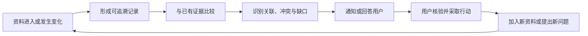

# 产品定位：ClawShelf 想解决什么问题

## 一句话定义

ClawShelf 是一个面向持续研究的、本地文件夹驱动的研究助手：它不仅保存和检索资料，还会在资料发生变化时主动判断“新证据改变了什么、连接了什么、还缺什么”，并把可回到原文核验的结果交给用户。

## 它要解决的不是“资料放在哪里”

研究资料不断增加时，真正困难的通常不是存储，而是维护理解：

- 新资料进入后，用户很难持续把它与所有旧资料重新比较；
- 同一个问题的证据散落在 PDF、笔记、表格和文章中；
- 结论可能相互支持、相互冲突，或只在不同条件下成立；
- 一次性摘要会快速过时，却不会告诉用户“这次变化意味着什么”；
- 普通搜索能找回内容，但仍把判断关联、证据缺口和下一步行动的工作留给用户；
- 仅靠记忆维护跨来源关系，资料越多，遗漏和误连的概率越高。

因此，ClawShelf 的核心问题可以表述为：

> 如何把一个持续变化的本地资料集合，变成一套可追溯、会更新、能主动帮助用户推进研究的证据系统？

## 三层产品价值

ClawShelf 把资料架组织成三个逐层增值的层次：

| 层次 | 回答的问题 | 主要产物 |
| --- | --- | --- |
| 事实层 | 每份资料说了什么，证据在哪里？ | 一份来源对应一份标准化 Markdown 记录 |
| 关联层 | 不同资料如何相互印证、冲突、补足或限制？ | 证据支持的连接、P1 事件、交互式关系图 |
| 行动层 | 这些变化对当前目标意味着什么，下一步值得做什么？ | 综合简报、候选想法、缺口和可验证方向 |

普通资料库往往把主要价值停留在事实层；ClawShelf 的产品重心在关联层和行动层，但任何高层结论都必须能回落到事实层核验。

## 与普通 knowledge base 的区别

这里的“普通 knowledge base”指以收集、整理、全文检索、向量检索或问答为主要体验的资料库。具体产品可能已经具备下表中的部分能力，因此这不是对所有知识库产品的绝对划分，而是 ClawShelf 的设计重心。

| 维度 | 普通 knowledge base 的常见方式 | ClawShelf |
| --- | --- | --- |
| 核心目标 | 让内容可存、可找、可问 | 持续维护跨来源理解并推动下一步研究 |
| 启动方式 | 用户发起搜索或提问 | 文件变化主动触发，同时支持按需提问 |
| 基本单元 | 文件、页面或切分后的文本块 | 带来源指纹、证据锚点和研究角色的资料记录 |
| 关系形成 | 文件夹、标签、链接或语义相似度 | 资料两侧的结构化信号经过证据校验后形成关系 |
| 对新增资料的处理 | 入库、索引、等待查询 | 标准化、与旧证据比较、判断影响并分级通知 |
| 输出重点 | 相关内容或问题答案 | 新关联、冲突、结论变化、证据缺口和候选行动 |
| 可信度 | 取决于检索结果和回答是否给出处 | 来源路径、证据位置、双边证据和置信度进入数据契约 |
| 用户数据 | 常见形态包括云端工作区 | 源文件保留在本地，生成物集中在 `clawshelf/` |

最关键的差异不是“有没有 RAG”，而是 RAG 在产品中的角色。ClawShelf 用检索来缩小候选范围，但不会把语义相似度直接当作知识连接或 P1 发现。关系是否成立，必须继续检查两份资料的具体信号和证据。

## 核心产品循环

这个循环让资料架不是一次性构建的静态成品，而是一段可以持续运行的研究过程。

## 设计原则

### 1. 先建立证据，再生成观点

新资料只有在提取、标准化和校验成功后，才能参与比较。不能根据文件名或元数据猜摘要，也不能把尚未完成处理的文件报告成“已入库”。

### 2. 主动，但不制造噪声

ClawShelf 区分两类成功事件：

- **P2**：资料已经可靠入库，但没有形成通过全部门槛的重要跨来源连接；
- **P1**：发现了重要连接，并且分数、置信度、判定结果和双边证据都满足要求。

P2 保持简短，P1 才展开说明。用户也可以关闭 P2 通知，只保留重要发现。

### 3. 连接必须可解释

“两篇文章很像”不是充分解释。一个连接应说明：

- 连接的是双方哪一种信号；
- 两侧证据分别来自哪里；
- 是支持、冲突、补足、迁移还是边界测试；
- 为什么它有意义，以及仍存在哪些风险。

### 4. 原始资料只读，生成物隔离

ClawShelf 不修改用户的源文件。标准化记录、事件、配置、简报和关系图统一写入源文件夹下的 `clawshelf/`，让数据归属、备份和删除边界保持清晰。

### 5. 面向目标组织资料，而不是建立唯一真相

首次启用时，ClawShelf 会从文件夹和当前请求推断一份 Shelf Plan，包括领域、工作方向、当前问题、资料增长方式和助手模式。它决定哪些标签、缺口和连接更重要，但不会删除与计划不一致的证据，也不会替用户消除来源之间的冲突。

## 产品边界

ClawShelf 在当前设计中：

- 不是云盘同步器或网页爬虫；
- 不是自动修改原始文件的整理工具；
- 不是仅凭相似度自动生成知识图谱的系统；
- 不是无需核验即可替用户作出研究、产品、投资或工程决策的自治代理；
- 不把每次新增资料都包装成“新发现”；
- 不要求 QMD 成为用户界面；QMD 是检索后端，标准化 Markdown 才是持久证据层。

它更接近一位持续维护证据、主动报告重要变化、但始终把出处和最终判断权交给用户的研究伙伴。

