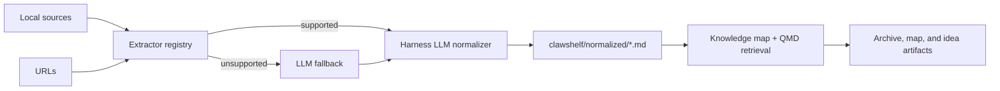

# ClawShelf Skill Design

## Purpose

ClawShelf turns a local document collection into a source-traceable research and
file-management companion. OpenClaw is the reference harness, but the workflow
is portable to Codex, Claude Code, OpenCode, and comparable harnesses.

See [`docs/jtbd.md`](jtbd.md) for the job this skill is hired to do, what's
explicitly out of scope, and the backlog of jobs it doesn't serve yet. This
doc covers the *how*; that one covers the *why*.

## Architecture



The input folder is read-only. ClawShelf writes only below `<input>/clawshelf/`:

```text
<input>/
└── clawshelf/
    ├── normalized/                # one source-traceable Markdown record/source
    ├── clawshelf-metadata.md       # archive and source inventory
    └── clawshelf-brief.md          # knowledge map, synthesis, idea cards
```

## Product functions

ClawShelf exposes three clear product functions:

1. **Content summarization and archiving.** Extract each source and turn it into
   a durable normalized record plus collection metadata.
2. **Modular search and knowledge map.** Maintain source clusters, topics,
   claims, methods, contradictions, gaps, and retrieval paths so users can
   navigate the shelf through natural language.
3. **Proactive idea generation.** Use the current Shelf Plan and new evidence to
   propose connections, changed conclusions, missing evidence, and best next
   research directions.

The third function is what makes ClawShelf a companion rather than a file
converter. It is allowed to make recommendations, but recommendation quality is
measured by source traceability and clear confidence labels.

## Onboarding and Shelf Plan

On first meaningful use, ClawShelf should collect a compact Shelf Plan if the
user has not already supplied enough context. Every onboarding question must
offer selections and allow a custom free-form answer. The canonical question set
lives in [`references/onboarding.md`](../references/onboarding.md):

- domain or professional background;
- research/work direction;
- concrete problem the shelf should help solve;
- collection type and update pattern;
- companion mode, such as research secretary, product secretary, investment
  research assistant, engineering knowledge assistant, or writing assistant.

The normal first-run path is `/clawshelf use <folder>`. It should feel like a
quick setup, not a form. If the folder is not onboarded, infer a Shelf Plan from
folder names, source filenames, file types, and the current request. Ask only
the few fields that materially change behavior; keep missing values as
`unknown`. Use the full canonical question set only when the user asks to
configure the shelf or inference is weak.

The Shelf Plan changes how records are tagged, how the knowledge map is shaped,
which gaps matter, and which idea triggers are useful. For example, a basic
science shelf emphasizes hypotheses, methods, experiments, and unresolved
theoretical tensions. An industrial product shelf emphasizes user pain, product
requirements, competitors, validation, and roadmap tradeoffs.

## Components

The workflow has internal contracts, documented in
[`references/component-contracts.md`](../references/component-contracts.md):

- extractor registry for deterministic source conversion;
- LLM fallback for unsupported but readable sources;
- normalizer for the stable Markdown record schema;
- QMD retrieval backend;
- metadata/synthesis renderers and storage layout.

Add supported file types by registering an extractor. Do not add provider SDKs:
the active harness performs semantic summarization and fallback reads. The
URL extractor fetches exactly one URL per call and never follows links — it
is a source extractor, not a crawler.

## Source lifecycle

1. Discover files and calculate each source SHA-256.
2. Extract Markdown/text, PDF, or XLSX content with the registered extractor.
3. Ask the harness LLM to create a summary record from actual content.
4. For unsupported sources, attempt local-file reading through the harness. Mark
   successful records `extraction_method: llm_fallback`; otherwise skip with a
   clear warning.
5. Reuse an existing normalized record only when its source fingerprint matches.
6. Register `clawshelf/normalized/` with QMD and retrieve evidence from it.
7. Create archive, knowledge-map, and idea artifacts that cite original source
   paths.

## Summary Schema

Normalized records use a hybrid paper-summary structure chosen for faithful
retrieval and later idea generation:

- `Summary` gives a 2-4 sentence scan-friendly overview.
- `Paper Role in Shelf` says how the source should function in the current
  Shelf Plan.
- `Research Question` and `Method / Data / Setting` make papers comparable.
- `Key Claims`, `Limitations`, `Idea Signals`, and `Connection Hooks` must carry
  evidence anchors so downstream synthesis can distinguish supported findings
  from speculation.
- `Limitations` always uses two universal subsections: `Use Conditions` for
  responsible application boundaries and `Improvement Directions` for concrete
  ways to strengthen, replicate, deepen, or extend the work.
- `Axon Signals` capture high-salience outgoing signals: strong contributions,
  methods, limitations, and application methods.
- `Dendrite Signals` capture lower-salience receptive signals: assumptions,
  data/domain boundaries, metric choices, failure modes, and extension hints.
- `RAG Terms` remain the compact retrieval vocabulary, with roles and aliases.

This keeps the simple IMRaD coverage that works for scientific papers, while
adding claim-evidence and connection-oriented fields needed by ClawShelf's
proactive idea generation.

The limitation taxonomy is domain-neutral: scope boundaries, data/evidence
limits, method/assumption limits, evaluation limits, generalization limits,
practical-use limits, uncertainty/conflicting evidence, and extraction/review
limits. Domain-specific concerns should map into these categories instead of
creating one-off required fields.

## Idea Generation

ClawShelf's first-pass idea generation uses relation-level signal matching
rather than keyword-only similarity. The deterministic layer extracts candidate
pairs from normalized `Axon Signals` and `Dendrite Signals`, then scores each
pair with overlap, complementarity, novelty, evidence, and feasibility.

Two idea modes are supported:

- Innovation: medium overlap plus strong complementarity, such as one article's
  method helping another article's limitation or application gap.
- Consolidation: high overlap plus a non-trivial difference, such as
  replication, stress testing, robustness checks, or benchmark extension.

Weak keyword-only analogies are rejected. Idea cards must explain both why the
idea is not simple repetition and why the analogy is structurally justified.
The detailed method and implementation checklist live in
[`docs/idea-generation-method.md`](idea-generation-method.md).

## Boundaries

- QMD indexes normalized Markdown; it does not need to parse every original file
  type and should not be exposed as the normal user interface.
- Every factual artifact claim needs an original-source reference. Uncited ideas
  are speculation.
- Proactive recommendations must state why they matter, what evidence supports
  them, what is still missing, and what the next action is.
- Remote connectors, databases, a public plugin API, and automated LLM API
  calls are outside v1.

## Development

Use `uv` for Python dependencies and `qmd` for the retrieval CLI. Run
`./scripts/bootstrap.sh` for setup and
`uv run --locked python -m unittest discover -s tests` for the deterministic
test suite.
