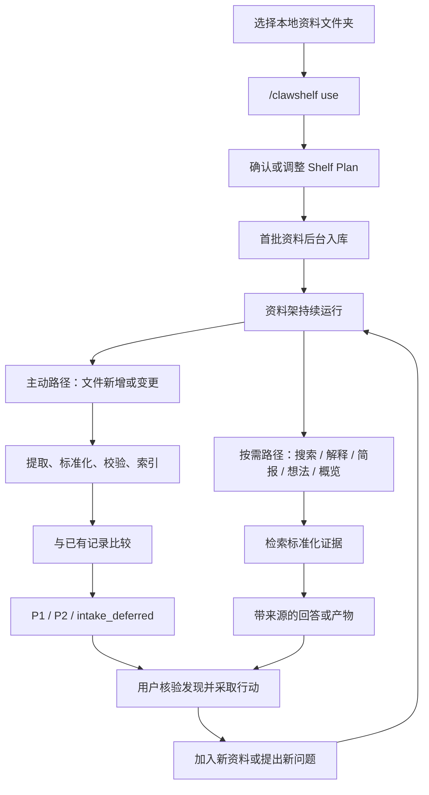

# 用户工作流：从选择文件夹到采取行动

## 工作流概览

ClawShelf 有两条互补路径：

- **主动路径**：用户启用资料架后，新文件或文件变更自动触发处理、比较和通知；
- **按需路径**：用户随时搜索、提问、生成简报、想法或关系图。

两条路径共用同一套标准化记录和来源证据，因此主动通知与按需回答不会各自维护一套互相漂移的知识。



## 阶段一：选择资料架

用户先把与一个研究目标相关的资料放在同一本地文件夹中。来源可以是 Markdown、文本、PDF、XLSX 或显式 URL；不支持但可读取的本地文件可以由宿主工具尝试提取。

```text
project-research/
├── interview-notes.md
├── market-report.pdf
└── experiment-results.xlsx
```

设计上以“文件夹”而不是“账号中的全局知识库”为工作边界，原因是：

- 一个文件夹通常对应一个相对明确的项目或问题空间；
- Shelf Plan、监控状态和通知路由可以按项目隔离；
- 用户可以用已有的文件同步、备份和权限方式管理资料；
- 原始资料与生成物的归属清晰。

用户应选择源文件夹本身，而不是其中的 `clawshelf/` 子目录。

## 阶段二：启用并建立 Shelf Plan

入口命令是：

```text
/clawshelf use /absolute/path/to/project-research
```

系统会：

1. 将该文件夹设为当前会话的资料架；
2. 检查它是未初始化、可用，还是部分损坏；
3. 为新资料架创建 `clawshelf/` 工作区；
4. 从文件夹名称、文件名、类型和用户当前请求推断 Shelf Plan；
5. 列出待处理来源并启动文件监控；
6. 把通知绑定到启用资料架的会话。

Shelf Plan 包含五个字段：

| 字段 | 它影响什么 |
| --- | --- |
| 领域 / 背景 | 哪些概念和证据类型更重要 |
| 工作方向 | 资料架是在支持综述、产品研究、实验跟踪还是写作等任务 |
| 当前具体问题 | 缺口、连接和下一步如何排序 |
| 资料增长模式 | 一次性批量、持续增长或高频变化 |
| 助手模式 | 研究、产品、投资、工程或写作语境下的表达与建议重点 |

快速启用时，系统可以先使用推断值运行确定性的初始化；用户看到完整预填结果后，可以确认或修改。无法可靠推断的字段保留为 `unknown`，不凭空补全。

## 阶段三：首批资料入库

对每份候选来源，系统执行同一条处理链：

1. 发现来源并计算 SHA-256 指纹；
2. 提取真实内容；
3. 生成包含摘要、方法、论点、局限、轴突/树突信号和证据位置的标准化记录；
4. 校验结构和证据字段；
5. 写入 `clawshelf/normalized/`；
6. 更新来源清单和检索索引。

来源指纹没有变化且已有记录结构完整时，可以复用记录。某一来源失败不会阻断整批资料，但失败的来源不会被伪装成已完成记录。

## 阶段四：持续监控新增与变更

资料架启用后，用户可以继续按原来的方式工作：复制文件、拖入报告、保存修改或把下载结果放进文件夹。系统等待文件稳定后，再走与首批资料相同的标准化路径。

以下内容不会被当作研究来源：

- `clawshelf/` 内部生成物；
- 隐藏文件、版本控制目录和虚拟环境；
- 临时文件和未完成下载；
- 新记录自身，不会参与与自己的比较。

处理成功后，新记录才会与已有记录进行候选召回、信号配对和证据校验。

## 阶段五：接收分级结果

### P2：资料已入库

P2 表示标准化和归档成功，但没有跨过 P1 的全部质量门槛。通知保持简短，可包含来源名称和关键论点，不应声称发现了跨来源关联，也不应附加研究建议。

用户可以选择：

- 保留 P2，获得每份资料的入库确认；
- 设置为 `p1_only`，只接收重要连接。P2 仍会正常记录和索引。

### P1：发现重要连接

P1 表示新资料与已有资料之间存在通过严格门控的连接。通知会说明：

- 连接了哪些原始来源；
- 双方证据分别在哪里；
- 关系为什么重要；
- 综合简报是否已经更新；
- 最多三个有来源依据的候选想法。

P1 发生时，系统会先尝试更新 `clawshelf-brief.md` 中的自动管理区域，再投递通知。它不会要求用户手动“再更新一次简报”。

### `intake_deferred`：处理尚未完成

如果标准化失败，或配置为必需的评分/检索无法完成，事件应标记为 `intake_deferred`。它既不是 P1，也不是 P2，不能发送“归档成功”的确认。

用户可以查看失败原因，补齐依赖或修复资料架后再刷新。

## 阶段六：按需研究

主动通知解决“我不知道自己应该问什么”，按需命令解决“我现在有一个明确问题”。

| 用户意图 | 入口 | 结果 |
| --- | --- | --- |
| 查找跨来源证据 | `/clawshelf search "问题"` | 带来源的相关证据 |
| 理解一个主题或冲突 | `/clawshelf explain "主题"` | 关系、支持、冲突和边界说明 |
| 得到综合判断 | `/clawshelf brief "问题"` | 综合、缺口和下一步方向 |
| 寻找可验证的新方向 | `/clawshelf ideas` | 创新或巩固型候选想法 |
| 查看整个资料网络 | `/clawshelf overview` | 本地可交互的神经元/突触关系图 |
| 查看来源覆盖 | `/clawshelf sources` | 已处理来源和提取状态 |
| 立即检查文件变化 | `/clawshelf refresh` | 立即执行一次增量扫描 |
| 检查或修复状态 | `/clawshelf status` / `repair` | 就绪状态或缺失产物修复 |

命令只是便捷入口。用户也可以直接说：

- “新报告加入后，哪些旧结论需要调整？”
- “找出这些访谈对留存原因的矛盾说法。”
- “现在哪个观点证据最强，哪个还只是猜测？”
- “给我一个成本最低的下一步验证方案。”

回答应优先检索标准化记录，并引用原始来源或记录中的证据位置。推测必须明确标记为推测。

## 用户可见的文件结构

ClawShelf 不修改源文件，只在源文件夹内创建独立工作区：

```text
project-research/
├── interview-notes.md
├── market-report.pdf
├── experiment-results.xlsx
└── clawshelf/
    ├── normalized/                 # 每份来源一份可追溯记录
    ├── events/                     # 文件监控与连接事件
    ├── notifications/              # 通知与去重记录
    ├── clawshelf-config.json       # Shelf Plan、通知和评分配置
    ├── clawshelf-metadata.md       # 来源清单
    ├── clawshelf-brief.md          # 按需创建或由 P1 更新的综合简报
    ├── clawshelf-overview.html     # 按需生成的交互式关系图
    └── watch-state.json            # 监控进程状态
```

其中，`normalized/` 是最重要的持久证据层。即使 QMD 暂时不可用，记录仍可由宿主直接读取；检索会进入降级状态，而不是让已经整理的知识消失。

## 异常与恢复路径

| 状态 | 用户看到什么 | 推荐动作 |
| --- | --- | --- |
| `ready` | 资料架可检索、可监控 | 继续添加资料或提问 |
| `not_onboarded` | 尚无 `clawshelf/` | 运行 `/clawshelf use` 或 `onboard` |
| `partial / broken` | 必需产物缺失或不一致 | 运行 `/clawshelf repair` |
| QMD 不可用（自动模式） | 记录保留，检索能力降级 | 修复 QMD；其间可直接读取 Markdown |
| 单个来源处理失败 | 该来源带警告，其他来源继续 | 检查文件内容/格式后刷新 |
| `intake_deferred` | 没有成功入库确认 | 根据事件原因修复后重试 |
| 通知投递失败 | 事件和本地记录仍保留 | 修复会话路由或通道后重试 |

## 理想的日常体验

对用户而言，正常工作流应当很轻：

1. 首次为一个项目选择文件夹并运行一次 `/clawshelf use`；
2. 确认 Shelf Plan 是否符合目标；
3. 继续按原习惯把资料放进文件夹；
4. 对 P2 只做快速确认，对 P1 回到原文核验；
5. 需要集中研究时直接提问、生成简报或打开关系图；
6. 把新的实验、报告或决策记录再放回资料架，进入下一轮。

系统承担的是持续整理、比较和提醒；用户保留问题定义、证据判断和最终决策。

